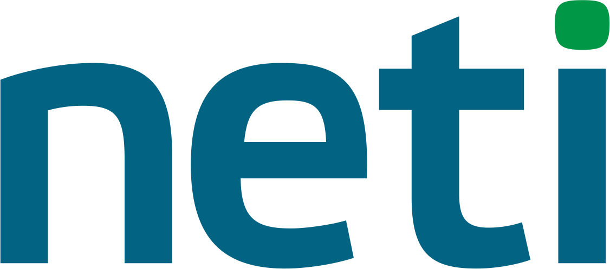

# 1C:ENTERPRISE IMPLEMENTATION, DEVELOPMENT AND SUPPORT
---
We will strengthen your team by 1C developers and consultants and
carry out your projects on a “turn-key” basis.

### FULL TIME
Manage our specialists as your own employees. 
##### 200+ 1C Senior and Middle staff developers and consultants

### TASK-SPECIFIC WORK
Pay only for effective works and hours of our specialists
##### 24 Month's warranty

## OUR APPROACH HELPS YOU TO SCALE AND REDUCE COSTS
* Confidentiality under NDA  
_We make an agreement on protection of data transferred. Our
employees sign a non-disclosure agreement_
* Individual SLA: 
 _We agree the level of service with each customer: we ratify availability of specialists, reaction time and terms of works_
* Seamless work:  
 _Your projects will not stop resulting from sick leaves or
annual leaves. If a developer gets ill, we will fast change a
specialist_
* Stable rates guarantee: 
_We record the rate in the agreement — you can plan your budget at ease_
* Entry interview 
_Test a specialist before he gets down to the project to make
sure that his expertise meets your requirements. If a specialist does not pass the interview, we will replace him_
* We are always in touch 
_We check our email every 15 minutes. We read messages in
Skype, Telegram, WhatsApp. We answer a telephone call no later than the 5th tone_
